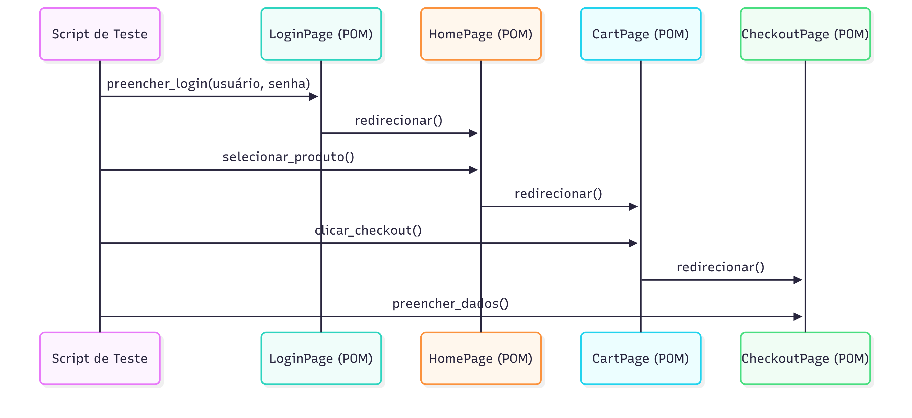

# 🔍 SauceCheck - Automação de Testes em Python  


Automação de testes para o site [SauceDemo](https://www.saucedemo.com/) usando **Selenium WebDriver + Python + Pytest**, 
seguindo o padrão **Page Object Model (POM)**.

## 🚀 Funcionalidades Testadas  
- Login (válido/invido).  
- Adição de produtos ao carrinho.  
- Validação de produto no inventário. 
- Checkout 

## ⚙️ Tecnologias  
- **Linguagem**: Python 3.x  
- **Frameworks**: Selenium WebDriver, Pytest  
- **Padrão**: Page Object Model (POM)  

## 📦 Como Executar  
1. Clone o repositório:  
   ```bash
   git clone https://github.com/KeilianeRocha/SauceCheck_project.git
   pip install -r requirements.txt  
   pytest tests/  
   



- **Status do CI/CD**: [](https://github.com/KeilianeRocha/SauceCheck_project/actions)

## 📊 Resultado dos Testes  
  


